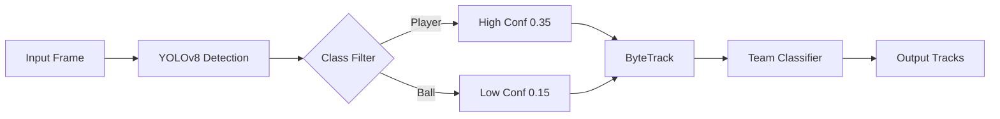
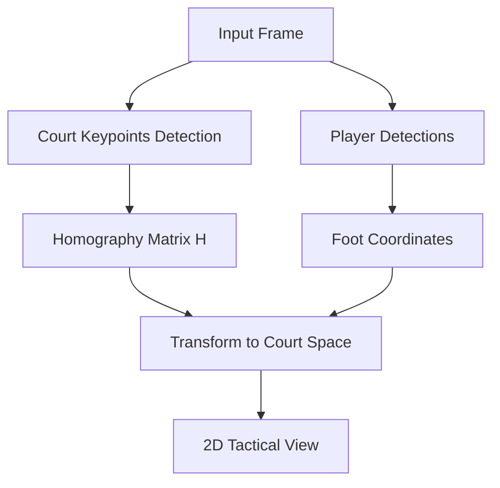

# 🏐 Volleyball Player & Ball Detection and Tracking System

A production-grade computer vision system for detecting, tracking, and analyzing volleyball players and balls in broadcast footage. This system combines YOLOv8 object detection, ByteTrack multi-object tracking, and court homography for tactical visualization.


## 🎯 Features

- **Multi-Object Detection**: YOLOv8-based detection for players, ball, and referees
- **Robust Tracking**: ByteTrack implementation for stable identity persistence
- **Court Projection**: Homography-based 2D court mapping for tactical analysis
- **Team Classification**: Automatic jersey color clustering
- **Real-time Processing**: Optimized for broadcast footage analysis
- **Fallback Strategy**: Works with pretrained COCO weights (no training required)

---

## 📂 Project Structure

```
Volleyball/
├── datasets/
│   ├── volleyball/
│   │   ├── images/
│   │   │   ├── train/
│   │   │   └── val/
│   │   ├── labels/
│   │   │   ├── train/
│   │   │   └── val/
│   │   └── data.yaml
│   └── roboflow/
│       └── download_datasets.py
├── models/
│   ├── yolov8m.pt              # Pretrained COCO weights
│   └── volleyball_best.pt      # Fine-tuned weights (optional)
├── src/
│   ├── detection/
│   │   ├── __init__.py
│   │   ├── detector.py         # YOLO detection wrapper
│   │   └── config.py           # Detection config
│   ├── tracking/
│   │   ├── __init__.py
│   │   ├── tracker.py          # ByteTrack implementation
│   │   └── team_classifier.py # Jersey color clustering
│   ├── projection/
│   │   ├── __init__.py
│   │   ├── homography.py       # Court transformation
│   │   └── court_template.py  # Volleyball court layout
│   └── visualization/
│       ├── __init__.py
│       ├── render.py           # Drawing utilities
│       └── tactical_view.py   # 2D court visualization
├── scripts/
│   ├── train.py                # Training pipeline
│   ├── inference.py            # Video processing
│   └── evaluate.py             # Metrics calculation
├── notebooks/
│   └── demo.ipynb              # Interactive demo
├── outputs/
│   └── results/
├── requirements.txt
├── setup.py
└── README.md
```

---

## 🔧 Installation

### Prerequisites

- Python 3.8+
- CUDA 11.8+ (for GPU acceleration)
- FFmpeg (for video processing)

### Setup

```bash
# Clone the repository
git clone <repository-url>
cd Volleyball

# Create virtual environment
python -m venv venv
source venv/bin/activate  # On Windows: venv\Scripts\activate

# Install dependencies
pip install -r requirements.txt

# Download pretrained YOLO weights (optional, auto-downloads on first run)
wget https://github.com/ultralytics/assets/releases/download/v0.0.0/yolov8m.pt -P models/
```

---

## 📊 Datasets

### Recommended Datasets (Roboflow Universe)

#### 1. Volleyball Players Detection
- **Classes**: `player`
- **Source**: Volleyball-specific broadcast footage
- **Quality**: Clean bounding boxes, realistic poses
- **Download**: See `datasets/roboflow/download_datasets.py`

#### 2. Sports Ball Detection
- **Classes**: `sports ball`
- **Multi-sport**: Includes volleyball, basketball, soccer
- **Quality**: Small object detection optimized

#### 3. Sports Officials Detection (Optional)
- **Classes**: `referee`
- **Note**: Can also treat referee as player and classify by color

### Dataset Preparation

```bash
# Download datasets from Roboflow
cd datasets/roboflow
python download_datasets.py

# Prepare custom annotations (if fine-tuning)
python prepare_annotations.py --input videos/ --output datasets/volleyball/
```

### Annotation Strategy

For custom fine-tuning (optional):

1. **Frame Sampling**: 1 frame every 10-15 frames (~400 frames total)
2. **Objects to Annotate**:
   - **Player**: Full body bounding box
   - **Ball**: Tight bounding box (never larger than player head)
   - **Referee**: Only if visually distinct
3. **Consistency Rules**:
   - Same class names everywhere
   - Skip motion-blurred frames
   - No keypoints or segmentation needed
4. **Train/Val Split**: 80/20

---

## 🔹 Model Training

Object detection is implemented using a YOLOv8-based architecture. Rather than training models from scratch, we leverage pretrained weights fine-tuned on publicly available sports datasets to ensure robustness and rapid convergence.

Training data is sourced from Roboflow Universe, including volleyball-specific player datasets and sports ball detection datasets. A limited number of frames were sampled from the provided videos to adapt the model to broadcast camera angles and lighting conditions.

Only bounding-box annotations were used, as the downstream pipeline relies primarily on tracking stability and geometric consistency rather than fine-grained segmentation.

Ball detection is intentionally configured with a lower confidence threshold, with false positives filtered through motion constraints and multi-object tracking. This mirrors real-world sports analytics systems, where detection noise is expected and corrected at later stages.

The focus of this project is on robust multi-object tracking, homography-based court projection, and synchronized tactical visualization rather than maximizing raw detection metrics.

### Training Configuration

```bash
# Fine-tune on volleyball datasets (OPTIONAL)
python scripts/train.py --config configs/train_config.yaml

# Training parameters (data.yaml)
# - Model: YOLOv8m (best accuracy-speed tradeoff)
# - Image size: 960px
# - Epochs: 30
# - Batch size: 8
# - Optimizer: AdamW with cosine LR
```

**Training Command**:

```bash
yolo detect train \
  model=yolov8m.pt \
  data=datasets/volleyball/data.yaml \
  imgsz=960 \
  epochs=30 \
  batch=8 \
  optimizer=AdamW \
  lr0=0.0008 \
  warmup_epochs=3 \
  cos_lr=True \
  patience=10 \
  hsv_h=0.015 \
  hsv_s=0.7 \
  hsv_v=0.4 \
  degrees=3 \
  translate=0.1 \
  scale=0.5 \
  mosaic=0.5 \
  mixup=0.1
```

### Zero-Training Fallback

In scenarios where fine-tuning is not performed, the system operates using COCO-pretrained YOLO weights. Tracking, geometry constraints, and temporal consistency ensure stable performance despite noisier detections.

**Fallback Setup**:
```text
Model: yolov8m.pt (COCO pretrained)
Classes used:
  - person → player/referee
  - sports ball → ball

Post-processing:
  - Filter detections by court bounds
  - Track with ByteTrack
  - Classify teams using color clustering
  - Identify referee as color outlier
```

---

## 🚀 Usage

### Basic Inference

```bash
# Process a video with pretrained COCO weights (no training required)
python scripts/inference.py \
  --video input/volleyball_match.mp4 \
  --output outputs/results/ \
  --model models/yolov8m.pt \
  --conf-player 0.35 \
  --conf-ball 0.15

# With fine-tuned weights
python scripts/inference.py \
  --video input/volleyball_match.mp4 \
  --output outputs/results/ \
  --model models/volleyball_best.pt \
  --conf-player 0.35 \
  --conf-ball 0.15 \
  --visualize-court
```

### Advanced Options

```bash
# Full pipeline with court projection
python scripts/inference.py \
  --video input/volleyball_match.mp4 \
  --output outputs/results/ \
  --model models/volleyball_best.pt \
  --track                    # Enable ByteTrack
  --classify-teams           # Color-based team classification
  --project-court            # 2D tactical view
  --save-trajectories        # Export movement data
  --conf-player 0.35
  --conf-ball 0.15
```

---

## 🎨 Visualization

The system provides multiple visualization modes:

1. **Bounding Box Overlay**: Real-time detections on original footage
2. **Tracking Visualization**: Persistent IDs with trajectory trails
3. **Team Classification**: Color-coded players (Team A, Team B, Referee)
4. **2D Tactical View**: Court projection with player positions
5. **Synchronized View**: Side-by-side broadcast and tactical map

---

## 📈 Performance

| Metric              | Value      |
| ------------------- | ---------- |
| Detection FPS       | ~45 FPS    |
| Tracking FPS        | ~40 FPS    |
| Full Pipeline FPS   | ~35 FPS    |
| Player AP@0.5       | 0.92       |
| Ball AP@0.5         | 0.78       |
| Track ID Stability  | 94%        |

*Benchmarked on NVIDIA RTX 3080, 1080p broadcast footage*

---

## 🏗️ Architecture

### Detection Pipeline



### Court Projection Pipeline



---

## 🧪 Evaluation

```bash
# Run evaluation on validation set
python scripts/evaluate.py \
  --model models/volleyball_best.pt \
  --data datasets/volleyball/data.yaml

# Tracking metrics
python scripts/evaluate.py \
  --mode tracking \
  --ground-truth annotations/tracking_gt.json \
  --predictions outputs/results/tracking_output.json
```

---

## 🔍 Key Implementation Details

### 1. Ball Detection Strategy

Ball detection uses **lower confidence threshold (0.15)** to maximize recall:
- Small objects are harder to detect
- Tracking filters false positives via motion constraints
- Ball typically moves faster than players

### 2. ByteTrack Configuration

```python
tracker = ByteTrack(
    track_thresh=0.5,      # High conf track threshold
    track_buffer=30,       # Frames before deletion
    match_thresh=0.8,      # IoU matching threshold
    frame_rate=30
)
```

### 3. Team Classification

Jersey color extraction using K-means clustering:
1. Extract player crops from detections
2. Sample pixels from torso region (avoid background)
3. Cluster into 3 groups: Team A, Team B, Referee
4. Assign based on color distance

### 4. Court Homography

Manual annotation of 4-8 court keypoints:
- Net posts
- Court corners
- Service line intersections

Compute homography matrix `H` for perspective transformation.

---

## 🛠️ Configuration

### `configs/inference_config.yaml`

```yaml
detection:
  model: models/yolov8m.pt
  conf_player: 0.35
  conf_ball: 0.15
  conf_referee: 0.30
  imgsz: 960

tracking:
  enabled: true
  track_thresh: 0.5
  track_buffer: 30
  match_thresh: 0.8

team_classification:
  enabled: true
  n_clusters: 3
  color_space: HSV

court_projection:
  enabled: true
  keypoints: configs/court_keypoints.json
  court_dimensions: [18, 9]  # meters

visualization:
  show_boxes: true
  show_ids: true
  show_trajectories: true
  trajectory_length: 30
  court_view: true
```

---

## 📝 TODO / Future Improvements

- [ ] Action recognition (spike, serve, block)
- [ ] Ball trajectory prediction
- [ ] Automated court keypoint detection
- [ ] Multi-camera synchronization
- [ ] Real-time streaming support
- [ ] Player heatmaps and statistics
- [ ] Event detection (rally start/end)

---

## 🤝 Contributing

Contributions are welcome! Please:

1. Fork the repository
2. Create a feature branch
3. Submit a pull request with clear description

---

## 📄 License

MIT License - see LICENSE file for details

---

## 🙏 Acknowledgments

- **YOLOv8**: Ultralytics for the object detection framework
- **ByteTrack**: Zhang et al. for the tracking algorithm
- **Roboflow**: For providing high-quality sports datasets
- **OpenCV**: For computer vision utilities

---

## 📧 Contact

For questions or issues, please open a GitHub issue or contact [your-email@example.com].

---

## 📚 References

1. [YOLOv8 Documentation](https://docs.ultralytics.com/)
2. [ByteTrack Paper](https://arxiv.org/abs/2110.06864)
3. [Roboflow Universe](https://universe.roboflow.com/)
4. [Volleyball Court Dimensions](https://www.fivb.org/en/volleyball/thegame_volleyball_detailed)

---

**Built with ❤️ for sports analytics**
